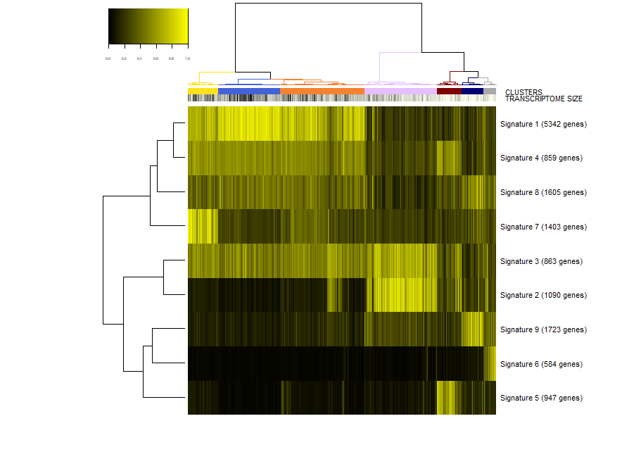

---
output:
  html_document: default
  pdf_document: default
---


# **bigSCale 2**

*bigSCale* is a complete framework for that analysis and visualization of single cell data. It allows to cluster, phenotype, perform pseudotime analysis and infer gene regulatory networks. 
```html
<span style="color:red">**Why using bigSCale 2?**</span>
```
<span style="color:red">**Why using bigSCale 2?**</span>

*  *bigSCale* features the most sensitive and accurate marker detection and classification. No PCA is used to reduce dimension, every bit of information is retained.
*  *bigSCale* allows to infer the gene regulatory netowrk for any single cell dataset
*  *bigSCale* allows to compress any large dataset into a small dataset without any loss of information.

<span style="color:red">**Quick Start**</span>

*bigSCale* is formed by three sub-tools which can be used independently or in synergy. Each sub-tool has its own quick-start guide.<br />
*bigSCale 2 Core* allows to cluster, phenotype and perform pseudo-time annalysis. It's is the main tool of bigSCale, published in.<br />
*bigSCale 2 GRN* is the newest addition: it is the module to infer gene regulatory networks from single cell data.<br />
*bigSCale 2 iCells* allows to reduce the dimention of any given large dataset (also millions of cells, wothout any loss of information) so that it can be easily and quickly analyzed by any tool. It DOES NOT require any external tool such as the loom framework.


### bigSCale 2 Core (clustering, phenotyping, pseudotime)

* [Quick start and basic usage](#bigscale-2-core) 
    + [Running bigSCale](#running-the-analysis)
    + [Visualizing results](#visualizing-the-results)
        - Clusters and  signatures of co-expressed genes
        - Markers of specific clusters
        - Barplot of a selected gene
        - Violin plot of a selected gene
        - Pseudotime
* Advanced use
    + Item 2a
    + [Link to Header](#the-header)
    

### bigSCale 2 Gene Regulatory Networks

* Quick start and basic use
    + Running bigSCale
    + Visualizing results
* Advanced use
    + Item 2a
    + [Link to Header](#the-header)
    

### bigSCale 2 iCells for big Datasets

* Quick start and basic use
    + Running bigSCale
    + Visualizing results
* Advanced use
    + Item 2a
    + [Link to Header](#the-header)


# **bigSCale 2 Core**

### **Running the analysis**

*bigSCale* works with the SingleCellExperiment class. This class is a container meant to store in an organized way single cell data.<br />
*bigScale* requires two elements to be present in the single cell class: the counts `counts()` and the gene names `rownames()`. **The counts must be raw counts! The genes must no be filtered, aside from removing, if you want, the gene with all zero values. **<br />
Let us first load an example dataset : 3005 single cells from adult mouse brain [Zeisel 2015](http://science.sciencemag.org/content/347/6226/1138.abstract)


```{r}
data(zeisel)
``` 


As you can see, the `zeisel` object contains the expression values for 19972 genes in 3005 cells. **In its most basic use, bigScale is run with just one command `zeisel=bigscale(zeisel)` which will automatically perform all the analysis**. However, for time reasons, we will instruct *bigSCale* to perform a quick analysis to save us time, by specifying `speed.preset='fast'`, which greatly reduces the the time required to compute  markers and differentially expressed genes. In a real analysis we reccomand **not to use** this setting, so to achieve maximum accuracy.

```{r,echo=TRUE, fig.keep='all'}
zeisel=bigscale(zeisel,speed.preset='fast') 
``` 

The analysis are now all complete and stored again in the `zeisel` object. In the next part we'll see how to visualize the results.


### **Visualizing the results**

### Clusters and  signatures of co-expressed genes

*bigSCale* feature a basic set of plot types to visualize the main results of clustering and phenotyping.<br />
First, we make a plot of the clusters and signatures of coexpressed genes.


```{r}
# All defaults
viewSignatures(zeisel)
```



In this plot you can see

+ The dendrogram representing how the cells are phenotypically organized and clusterd
+ Colored bars representing the clusters, the library size (meant as a proxy to transcriptome size/complexity) and the pseudotime of the cells. An additional color bar is displayed for any user custom colData() (For example, if you previously set the sample batch by running .). For custom user colData, the color codes are automatically chosen upoen the type of data (numeric or factor) 
+ The clustered signatures of coexpressed genes alogside their size. Here, all the genes differentially expressed are organized in signatures of co-expressed genes.


### Markers of specific clusters


Next, we would like to inspect the markers of a specific cluster, let us say cluster xx. To this end, we run.

```{r}
viewSignatures(sce,selected.cluster=xx) 
``` 

Now, the plot is the same as before, but in place of the signature of coexpressed genes we see the markers of cluster xx stratified by level of specificity. In case you did not read the paper link, markers of level 1 are the most specific to a given cluster. Level 1 means that this markers are expressed only in cluster xx. However, shared markers are also very important in biology. Let us think to all markers shared by neuronal cell types as opposed to glial cell types. Here come into play the markers of higher levels. Markers of level 2 are markers shared between cluster xx and at most another cluster. Markers of level 3 are shared shared between cluster xx and at most two other clusters, and so on. These markers of higher levels are typcally lost by other computational tools.


### Barplot of a selected gene


### Violin plot of a selected gene


### Pseudotime


